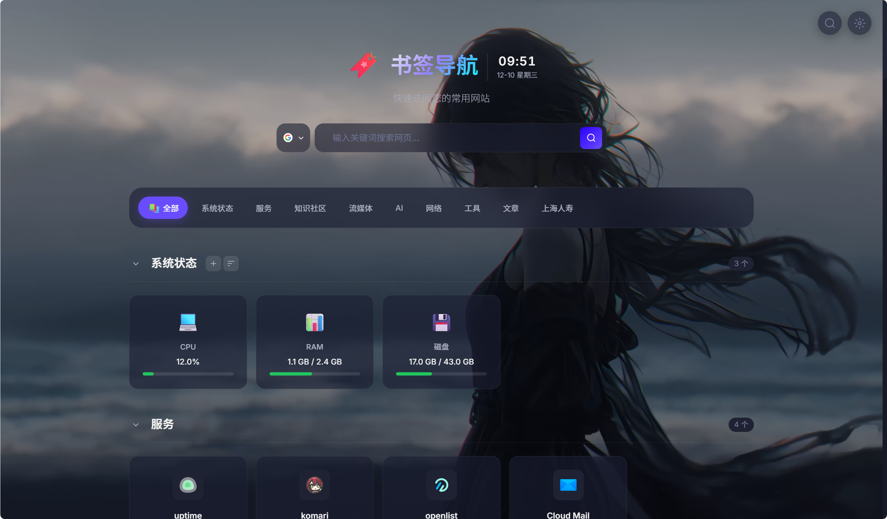

# 书签导航

一个面向个人自用的中文书签导航 / 个人入口页。它把书签、分类、搜索引擎、待办、图标、壁纸、数据同步、AI 摘要、PWA 桌面入口和快捷命令面板放在同一个页面里，适合部署在 NAS、家用服务器或个人 VPS 上。



## 功能概览

- 书签管理：支持分类、新增、编辑、删除、排序、访问计数和标签。
- 批量整理：可在当前分类或搜索结果中批量移动分类、增删标签、刷新图标或移入回收站。
- 搜索入口：可配置多个搜索引擎，也可以在浮层里快速过滤书签。
- 命令面板：按 `Cmd/Ctrl+K` 或 `/` 快速搜索书签、分类、搜索引擎并执行新增书签、打开设置、查看 TODO 等操作。
- PWA 入口：支持安装到手机/桌面主屏幕，提供离线应用壳。
- PWA 更新：发现新版本时提示手动刷新，激活期间保留当前与上一版静态缓存。
- 个性化界面：支持主题、Logo、壁纸、时钟、页脚、内容宽度和组件显隐。
- TODO 待办：支持快速添加、编辑、完成、删除和拖拽排序。
- 图标库：可自动发现 favicon，也可上传、复用、批量获取或修复图标。
- 数据同步：支持本地 JSON 导入导出、浏览器书签 HTML 导入和 WebDAV 上传/下载。
- AI 辅助：可为书签生成摘要、标签和分类建议，支持 OpenAI 兼容接口。
- 数据库：使用 SQLite（WAL 模式），性能优秀，适合个人部署。
- 自动迁移：容器升级时会检查 SQLite 结构，并在迁移前生成在线数据库备份。
- 自动备份：每天生成并校验一份 SQLite 在线备份，完整恢复前也会自动留存快照。
- 发布追踪：健康接口和“关于”页显示版本、Git commit、构建时间、数据库 schema 与最近备份时间。
- 数据健康：只读检查重复/异常 URL、缺失分类、图标和标签，并可显式启动低并发失效链接检查。
- 异地备份：可选将 SQLite 快照自动上传 WebDAV，并下载回临时目录验证可打开性。
- 快速收藏：支持 Bookmarklet 和 PWA Web Share Target，预填后由用户确认保存。
- 大数据优化：预计算搜索文本、IndexedDB 冷启动回退，以及二分定位的虚拟滚动。

## 快速部署

### Docker Compose（SQLite）

SQLite 是默认模式，适合单实例个人部署。

```bash
mkdir bookmarks
cd bookmarks
curl -O https://raw.githubusercontent.com/ZJ-zhangcn/bookmarks/main/docker-compose.yml
touch .env
docker compose up -d
```

启动后访问：

```text
http://localhost:8080
```

数据会持久化到 Docker volume `bookmark-data`，容器重建不会丢失。

### 本地开发

项目要求 Node.js `>=20.19.0`。

```bash
npm install
npm run dev
```

后端默认监听 `http://localhost:3000`，会直接服务 `dist/` 或 `frontend/`。

## PWA 与快捷操作

### 安装到桌面

项目构建产物包含 `manifest.webmanifest`、`service-worker.js` 和 PWA 图标。部署后在支持 PWA 的浏览器中打开站点：

- iOS Safari：分享按钮 → 添加到主屏幕。
- Android Chrome / Edge：菜单 → 安装应用 或 添加到主屏幕。
- 桌面 Chrome / Edge：地址栏右侧安装图标。

离线或弱网时，Service Worker 会优先保证应用壳可打开，并对 `/api/bootstrap-v2` 使用 network-first 策略，避免写接口被缓存。

### 命令面板

快捷键：

```text
Cmd/Ctrl+K  打开命令面板
/           在未输入状态下打开命令面板
Esc         关闭命令面板
↑ / ↓       切换选中项
Enter       执行当前命令
```

命令面板支持：

- 搜索并打开书签。
- 跳转分类。
- 切换搜索引擎。
- 新增书签。
- 打开设置。
- 跳转 TODO。

如果只调前端，可另起 Vite：

```bash
npm run dev:frontend
```

## 配置说明

大多数个人部署不需要配置很多变量。数据库固定为 SQLite，可以直接启动；只有开放公网、WebDAV 内网地址或 AI 时才需要改 `.env`。

### 常用变量

| 场景 | 变量 | 说明 |
| --- | --- | --- |
| 修改端口 | `PORT` | 后端监听端口，默认 `3000`；Docker 默认映射到宿主机 `8080`。 |
| 访问控制 | `AUTH_MODE` | `anonymous` 适合个人内网；`token` 适合公网；`off` 完全关闭鉴权。 |
| 管理令牌 | `ADMIN_TOKEN` | `AUTH_MODE=token` 时，写接口需要 `Authorization: Bearer ***`。 |
| 内网访问 | `ALLOW_PRIVATE_NETWORK` | WebDAV、图标抓取或 AI 网关需要访问内网地址时开启。 |
| 启用 AI | `AI_ENABLED` | 设置为 `true` 后，配置 OpenAI Key 即可。 |
| 迁移备份数 | `DB_MIGRATION_BACKUP_LIMIT` | 数据库升级前自动备份的保留数量，默认 `5`。 |
| 每日备份 | `DB_DAILY_BACKUP_ENABLED` | 是否自动创建每日 SQLite 备份，默认开启。 |
| 每日备份数 | `DB_DAILY_BACKUP_LIMIT` | 每日备份的保留数量，默认 `14`。 |
| 恢复前备份数 | `DB_RESTORE_BACKUP_LIMIT` | 完整恢复前快照的保留数量，默认 `5`。 |

### SQLite 升级与迁移

服务启动时会在监听端口前检查数据库版本。首次启用迁移机制时，已有完整数据库会登记为基线版本，不会清空或重建业务数据；数据库中的额外扩展表也会保留。

需要升级结构时，程序会先通过 SQLite 在线备份 API 将完整快照写入数据卷中的 `migration-backups/`，再在事务中执行迁移。迁移失败时服务不会启动，数据库版本标记和结构变更会回滚。

### AI 配置

仅支持 OpenAI 兼容接口（可用于 OpenAI、DeepSeek、OneAPI 等）：

```env
AI_ENABLED=true
AI_MODEL=gpt-4o-mini
AI_BASE_URL=https://api.openai.com/v1
OPENAI_API_KEY=your-key
```

前端默认允许临时传入自定义 Key 和 Base URL，自用部署无需额外配置。

高级 AI 参数、CORS 等开关见 `.env.example`。这些不是常规部署必需项，建议只在明确需要时开启。

### 推荐组合

- 个人内网：SQLite 默认部署，保留 compose 中的免鉴权配置即可。
- 公网访问：设置 `AUTH_MODE=token` 和 `ADMIN_TOKEN`。
- WebDAV 同步 NAS：在 WebDAV 配置正确的基础上，增加 `ALLOW_PRIVATE_NETWORK=true`。
- 数据库固定使用 SQLite，数据文件和自动备份都保存在 Docker 数据卷中。

旧版变量仍兼容，包括 `ALLOW_ANONYMOUS_WRITE`、`DISABLE_ADMIN_AUTH`、`ALLOW_PRIVATE_FETCH`、`AI_ALLOW_CLIENT_KEY`、`AI_ALLOW_CLIENT_BASE_URL`、`AI_ALLOW_CLIENT_PROVIDER`、`AI_ALLOW_CLIENT_PARAMS` 和 `AI_ALLOW_PRIVATE_BASE_URL`。新部署建议优先使用上表里的合并变量。

## 数据备份与同步

### 批量整理

点击右上角的选择按钮进入批量模式。批量操作以 SQLite 单事务执行，单次最多 500 条；不存在的书签会计入跳过数，失败时不会留下半完成状态。标签可在搜索、编辑和批量操作中使用。

### 数据健康与链接检查

设置页的数据健康检查只读取数据库，可检查重复 URL、异常 URL、缺失分类、缺失图标、无标签和 180 天未访问的书签，同时执行 SQLite `integrity_check`。检查结果会按问题类型展开，并可点击回到对应书签。失效链接检查必须手动启动，固定并发 3、单链接约 5 秒超时；401、403 和 429 只标为待确认，普通失败连续出现两次后才标为失效。结果保存在 SQLite schema v3 的 `bookmark_link_health` 表中。

### 快速收藏

设置页可以复制 Bookmarklet。浏览器打开 `/?action=add&url=...&title=...`，或通过已安装 PWA 的系统分享菜单发送 URL 时，页面只会预填新增书签弹窗，不会自动保存。

### 本地导入导出

在页面右上角打开设置，进入“数据同步”：

- 导出配置：下载当前分类、书签、搜索引擎、设置、TODO 和图标数据。
- 导入配置：可选择“合并导入”，或用“完整恢复”替换当前应用数据。
- 导入浏览器书签：支持 Chrome、Firefox、Edge 导出的 Netscape HTML 文件；导入前会预览新增、重复和分类复用数量，可选择跳过或更新重复书签。

导出时可以选择是否包含图标。包含图标更完整，但文件会更大。

浏览器书签导入会对 HTTP(S) URL 做保守归一化后去重：忽略页面片段并统一主机、默认端口等标准形式，但不会删除查询参数或自动改写协议。重复导入时默认跳过已有书签；选择“更新重复书签”时，只更新名称、URL 和所属分类，保留原有描述、图标、访问次数与 AI 数据。

完整恢复会先校验备份内容，再将当前分类、书签、搜索引擎、TODO、图标库和个性化设置替换为备份内容。恢复前会在数据卷的 `restore-backups/` 中自动生成并校验 SQLite 快照；项目以外的扩展表和配置不会被清理。

WebDAV 下载提供“下载并合并”和“下载并完整恢复”两种模式；完整恢复会覆盖当前应用数据，并在执行前要求确认。

服务启动后会创建当天的在线备份，并每 6 小时检查一次。每日备份位于数据卷的 `daily-backups/`，按 UTC 日期每天最多创建一份，默认保留最近 14 份。备份创建后必须通过 SQLite `integrity_check`，损坏的当日文件会在下次检查时自动重建。

异地备份可通过 `DB_OFFSITE_BACKUP_ENABLED=true` 开启。服务会把经过完整性校验的 SQLite 备份上传到 WebDAV 临时文件，重命名为最终文件，再下载到临时目录并只读打开验证。设置页面只显示状态、文件名、大小和摘要，不返回 WebDAV 密码。完整变量见 [.env.example](./.env.example)。

## 版本追踪与性能基线

`GET /api/health` 返回应用版本、Git commit、镜像构建时间、SQLite schema 版本和最近备份信息。同样的信息可在设置的“关于”页面查看，方便确认 VPS 当前实际运行的镜像。

浏览器性能基线使用 10 个分类、5000 条书签，并验证响应体积、JSON 解析、首屏加载、搜索耗时和虚拟滚动后的 DOM 数量。2026-08-29 本机 Chrome 基线：响应约 `1.23 MB`、解析约 `1.5 ms`、首屏约 `466 ms`、搜索约 `332 ms`、页面实际渲染约 `60` 张卡片。CI 使用较宽松的回归阈值，避免机器波动导致误报。

### WebDAV

在“数据同步”里填写 WebDAV 地址、账号、密码和保存路径，然后执行上传或下载。

如果 WebDAV 服务在 NAS、路由器或其他内网地址上，需要同时开启：

```env
ALLOW_PRIVATE_NETWORK=true
```
## 常用脚本

```bash
npm run dev             # 启动后端，直接服务 frontend 或 dist
npm run dev:frontend    # 启动 Vite 前端开发服务
npm run build:frontend  # 构建前端到 dist
npm run preview         # 预览前端构建产物
npm run lint            # 运行 ESLint
npm run lint:fix        # 自动修复 ESLint 可修复问题
npm test                # 运行 node:test 测试
npm run test:e2e        # 运行 Playwright 浏览器 E2E 与性能基线
npm run test:e2e:ui     # 交互式调试 Playwright 测试
npm run audit:high      # 检查高危依赖问题
```

## 项目结构

```text
bookmarks/
├── backend/              # Express 后端、API 路由、数据库入口
│   ├── server.js         # 服务入口
│   ├── db.js             # SQLite 数据库层
│   ├── ai.js             # AI 路由注册
│   ├── bootstrap-v2.js   # 首屏聚合接口
│   ├── middleware/       # 鉴权和安全校验
│   └── routes/           # 分类、书签、图标、WebDAV、数据同步等 API
├── frontend/             # 原生 HTML/CSS/JS 前端
│   ├── index.html
│   ├── index.css
│   ├── main.js
│   ├── manifest.webmanifest
│   ├── service-worker.js
│   ├── assets/           # PWA 图标等静态资源
│   └── modules/          # 前端功能模块
├── shared/services/      # 前后端复用的业务服务
├── tests/                # node:test 与 Playwright E2E 测试
├── Dockerfile
└── docker-compose.yml
```

## 排障提示

- 页面能打开但保存失败：检查 `AUTH_MODE` 和 `ADMIN_TOKEN`。
- WebDAV 到 NAS 失败：确认 URL、账号、路径正确，并开启 `ALLOW_PRIVATE_NETWORK=true`。
- AI 按钮提示未启用：确认 `AI_ENABLED=true`，并配置当前 provider 对应的 Key。

## 许可证

本项目使用 [MIT License](./LICENSE)。
